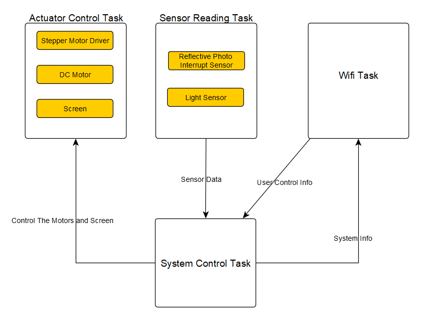
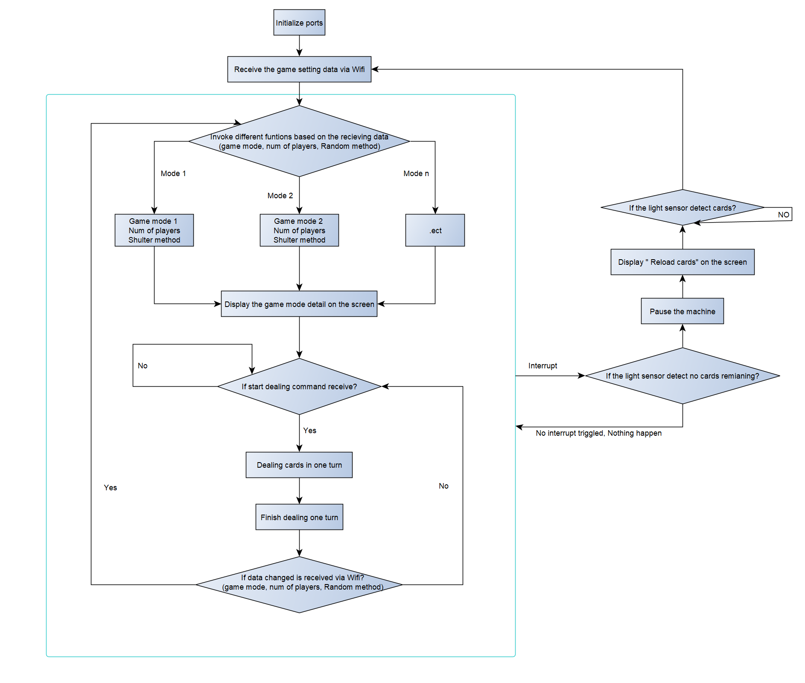
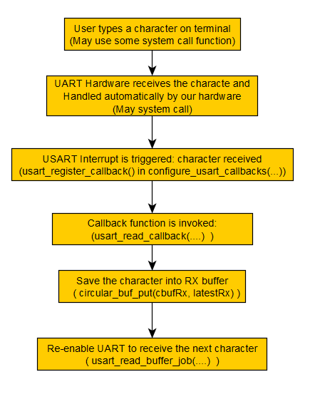
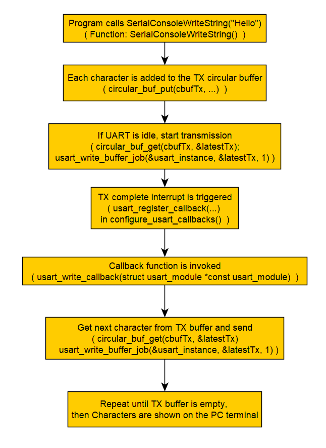
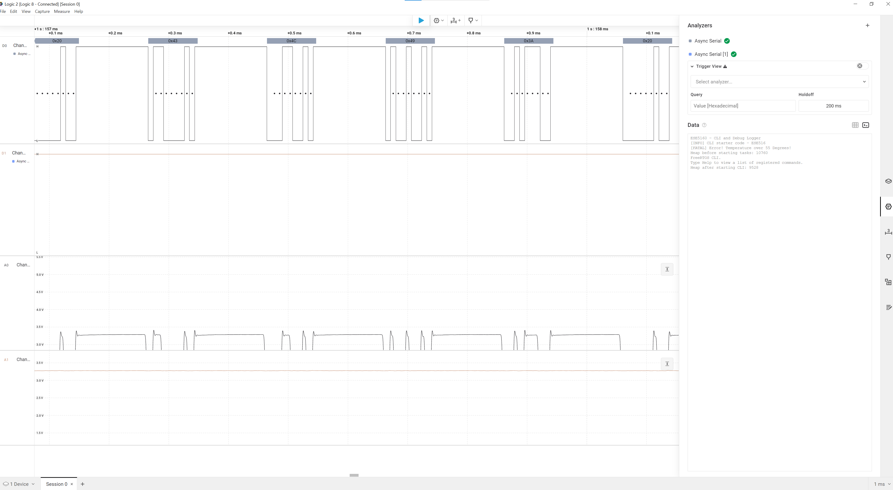

# a07g-exploring-the-CLI

* Team Number: 8
* Team Name: Gambler
* Team Members: Tianyu Gao, Hao Tan
* GitHub Repository URL: https://github.com/ese5160/final-project-a07g-a14g-t08-gambler.git
* Description of test hardware: (development boards, sensors, actuators, laptop + OS, etc)

# 1. Software Architecture  

## Hardware and Software Requirements Specification

### Hardware Requirements Specification

- **HRS 01 - Microcontroller Core:** The project shall use the SAMW25 microcontroller, which provides Wi-Fi connectivity.
- **HRS 02 - Card Dealing:** A DC motor shall be used to control the number of cards dealt in a single turn. The quantity shall be managed by adjusting the motor's speed and operating duration.
- **HRS 03 - Direction Control:** A stepper motor shall be used at the base to control the card dealing direction. The motor shall support 2 to 4 directions, allowing the system to accommodate games with 2 to 4 players seamlessly.
- **HRS 04 - Card Count and Motor Optimization:**   
  - Shall use a Reflective Photo Interrupt Sensor to calculate the number of cards dealt by measuring the time it is obstructed during operation.
  - This sensor shall also aid in the control and optimization of the DC motor to ensure precise card dealing, as achieving accuracy with a DC motor alone can be challenging.
- **HRS 05 - Card Box Monitoring:** A Light Sensor shall be placed in the card box to monitor the remaining cards, ensuring the system can provide real-time updates on card availability.
- **HRS 06 - I2C Screen:** An I2C screen displays game mode details, the number of players, and the selected randomization method.
- **HRS 07 - Wi-Fi Internet Connectivity:** Shall utilize the integrated Wi-Fi in the SAM W25, the device shall connect to the internet, enabling it to upload acquired data to a remote display and allowing for remote control.

### Software Requirements Specification

- **SRS 01 – Initialization and Configuration:**
  - The system shall initialize and configure the SAMW25 microcontroller, including setting up the Wi-Fi module and any necessary network configurations.
- **SRS 02 – Randomization and Shuffle Logic:**
  - The software shall implement a PRNG to randomize the sequence of card dealing, ensuring fairness.
  - Users may select or adjust the randomization method via the mobile app if multiple shuffle intensities are available.
- **SRS 03 – DC Motor Control for Card Output:**
  - The software shall determine the DC motor speed and duration based on the required number of cards per dealing cycle.
  - It shall adjust motor operation in real-time, using sensor feedback to correct miscounts or jams.
- **SRS 04 – Stepper Motor Direction Control:**
  - The software shall rotate the stepper motor to direct the next card(s) to the selected player position (2–4 possible directions).
  - The system must handle transitions smoothly, preventing mechanical stress or misaligned deals.  
- **SRS 05 – Sensor Integration for Card Counting:**
  - The software shall continuously read the Reflective Photo Interrupt Sensor to count cards as they are dealt, ensuring accuracy.
  - A light sensor, placed within the card tray, shall monitor the deck supply, triggering empty-deck alerts.
- **SRS 06 – Wi-Fi Connectivity and Remote Control:**
  - The software shall connect to a local network using the SAMW25’s Wi-Fi interface.
  - The user shall be able to configure game parameters (e.g., player count, game mode, dealer position) through a mobile or web-based interface.


## Block Diagram   



More Information in the Block Diagram:
- A **DC motor** shall be used to control the number of cards dealt in a single turn in one direction
- A **stepper motor** shall be used at the base to control the card dealing direction. (2 to 4 directions)
- A **Reflective Photo Interrupt Sensor** shall be used to calculate the number of cards dealt by measuring the time it is obstructed during operation.
- A **Light Sensor** will be placed in the card box to monitor the remaining cards, ensuring the system can provide real-time updates on card availability.
- The software shall implement a PRNG to randomize the sequence of card dealing, ensuring fairness. eg. dealing different number cards(DC motor) in each turn and shuffle the dealing order (Stepper motor) to ensure random dealing.
- Select the player count, game mode, dealer position through a mobile or web-based interface via Wifi Task.
- Read the data from Wifi Task, processing the data and send corresponding control commands(System control task) to the actuator and sensor tasks. And displaying the game mode details, the number of players, and the selected randomization method in the screen.


## Flowcharts  




### **1. Initialization**
- **Initialize ports** to prepare for operation.
- **Receive game settings via WiFi**, including:
  - Game mode
  - Number of players
  - Randomization method

### **2. Game Mode Processing**
- Invoke different functions based on received data.
- Each mode includes:
  - **Game mode type**
  - **Number of players**
  - **Shuffle method**
- **Display game mode details on the I2C screen**.

### **3. Dealing Process**
- **Wait for "start dealing" command**.
- If received:
  1. **Deal cards for one turn**.
  2. **Complete the turn**.
- Check for **new WiFi data updates** after each turn.

---

### **4. Sensor-Based Interaction (Interrupt Handling)**
#### **Checking for Remaining Cards**
- **Light sensor detects card availability**:
  - **No cards detected** → **Pause operation & display "Reload cards"**.
  - **Cards available** → Continue dealing.

#### **Interrupt Handling**
- **If interrupt is triggered** → Notify user to **reload cards**.
- **If no interrupt is triggered** → Nothing Happen.


### **5. Summary**
- **WiFi Communication**: Retrieves game settings dynamically.
- **Game Mode Handling**: Displays settings and manages game mode.
- **Card Dealing**: Executes upon start command.
- **Sensor Monitoring**: Uses **light sensor interrupts** to detect cards.
- **User Prompts**: Notifies when action is required.

# 2. Understanding the Starter Code

**1.What does “InitializeSerialConsole()” do? In said function, what is “cbufRx” and “cbufTx”? What type of data structure is it?**  

1. Initializes two circular buffers, `cbufRx` and `cbufTx`, using the function `circular_buf_init()`. These buffers are used to store received and transmitted characters respectively.
2. Configures the USART hardware using `configure_usart()`, which sets parameters like baud rate (115200), parity, and pin settings.
3. Registers USART read and write callbacks with `configure_usart_callbacks()` to handle asynchronous UART communication.
4. Starts the UART read using `usart_read_buffer_job()` to begin receiving characters from the UART interface.  


The variables `cbufRx` and `cbufTx` are both of type `cbuf_handle_t`, which is a pointer to a circular buffer structure (`circular_buf_t`). This structure is implemented in `circular_buffer.c`. It supports FIFO operations for managing UART data efficiently.

**2.How are `cbufRx` and `cbufTx` initialized? Where is the library that defines them (please list the \*.c file they come from).**

Initialization:
In the `InitializeSerialConsole()` function they are initialized using the function `circular_buf_init` function, 
they are initialized with buffer and size:

```c
cbuf_handle_t circular_buf_init(uint8_t* buffer, size_t size)
{
	cbuf_handle_t cbuf = malloc(sizeof(circular_buf_t)); // Allocates the struct
	cbuf->buffer = buffer;    // Assigns the external buffer
	cbuf->max = size;         // Stores the buffer size
	circular_buf_reset(cbuf); // Sets head=0, tail=0, full=false
	return cbuf;
}
```

Inside `circular_buf_init()`, which does the following:

1. `malloc(sizeof(circular_buf_t))`
   - Allocates memory for the struct and returns a pointer to this struct, which is `cbuf_handle_t`.

2. `cbuf->buffer = buffer;`
   - Points the internal `buffer` field to the memory `rxCharacterBuffer` or `txCharacterBuffer`.

3. `cbuf->max = size;`
   - Stores the total buffer capacity (e.g. `512` bytes).

4. `circular_buf_reset(cbuf);`
   - Initializes:
     ```c
     cbuf->head = 0;
     cbuf->tail = 0;
     cbuf->full = false;
     ```

They two just share the same logic, but use different buffers for RX and TX.


They are defined in **circular_buffer.h** and implementation in **circular_buffer.c**

**3.Where are the character arrays where the RX and TX characters are being stored at the end? Please mention their name and size.**  
**Tip: Please note cBufRx and cBufTx are structures.**

The character arrays where the RX and TX characters are stored are `rxCharacterBuffer` and `txCharacterBuffer`, each with a size of 512 bytes. These arrays are defined in `SerialConsole.c` as:

```c
#define RX_BUFFER_SIZE 512 //< Size of character buffer for RX, in bytes
#define TX_BUFFER_SIZE 512 //< Size of character buffers for TX, in bytes
//.......
char rxCharacterBuffer[RX_BUFFER_SIZE];  //< Buffer to store received characters
char txCharacterBuffer[TX_BUFFER_SIZE]; //< Buffer to store characters to be sent
```


**4.Where are the interrupts for UART character received and UART character sent defined?**   

The interrupts for UART character received and UART character sent are defined as **callback functions** in `SerialConsole.c` :

- UART Character Received Interrupt  
   Defined in the function:
   ```c
   void usart_read_callback(struct usart_module *const usart_module)
   ```
- UART Character Sent Interrupt  
Defined in the function:
   ```c
   void usart_write_callback(struct usart_module *const usart_module)
   ```

**5.What are the callback functions that are called when:**  
1. A character is received? (RX):  
 - **Callback Function:** `usart_read_callback(struct usart_module *const usart_module)`. It is called when the UART receives a character. Typically registered and enabled in the UART configuration to handle incoming data.


2. A character has been sent? (TX) 
  - **Callback Function:** `usart_write_callback(struct usart_module *const usart_module)`. It is called when the UART has finished transmitting a character. It's set up during the UART initialization to handle outgoing data.


**6.Explain what is being done on each of these two callbacks and how they relate to the cbufRx and cbufTx buffers.**

- **`usart_read_callback()` – Character Received (RX):**  
  - What it does:  
    When a character is received by the UART, it is first stored in `latestRx`.  
    The callback then puts this character into the RX circular buffer (`cbufRx`) using `circular_buf_put()`,  
    and immediately starts a new asynchronous read using `usart_read_buffer_job()` to keep receiving the next character.

  - Relation to cbufRx:  
    `cbufRx` holds all the received characters from UART. This callback ensures that every incoming character is saved into the buffer so it can be retrieved later by the main program, without missing any data.


- **`usart_write_callback()` – Character Sent (TX):**  
  - What it does:  
    After a character has been transmitted, it checks if there are more characters in the TX buffer (`cbufTx`). If there is another character, it sends it using `usart_write_buffer_job()`

  - Relation to cbufTx:  
    `cbufTx` holds all characters that need to be sent. This callback keeps the transmission going until the buffer is empty.  

    
**7.Draw a diagram that explains the program flow for UART receive – starting with the user typing a character and ending with how that characters ends up in the circular buffer “cbufRx”. Please make reference to specific functions in the starter code.**  

As I just mentioned and explain the process above, and draw it as following:  



**8.Draw a diagram that explains the program flow for the UART transmission – starting from a string added by the program to the circular buffer “cbufTx” and ending on characters being shown on the screen of a PC (On Teraterm, for example). Please make reference to specific functions in the starter code.**  

As I just mentioned and explain the process above, and draw it as following:  



**9.What is done on the function “startStasks()” in main.c? How many threads are started?**

The `StartTasks()` function is for initializing FreeRTOS tasks after the system and hardware are initialized.

**What happen:**
1. **Print available heap memory before creating tasks**
   ```c
   snprintf(bufferPrint, 64, "Heap before starting tasks: %d\r\n", xPortGetFreeHeapSize());
   SerialConsoleWriteString(bufferPrint);
   ```
2. **Create the CLI task**
    ```c
    xTaskCreate(vCommandConsoleTask, "CLI_TASK", CLI_TASK_SIZE, NULL, CLI_PRIORITY, &cliTaskHandle);
    ```
3. **Print heap memory after creating the task**
    ```c
    snprintf(bufferPrint, 64, "Heap after starting CLI: %d\r\n", xPortGetFreeHeapSize());
    SerialConsoleWriteString(bufferPrint);
    ```

**How many threads are started?**  
Only 1 thread is started in StartTasks():  
`xTaskCreate(vCommandConsoleTask, "CLI_TASK", CLI_TASK_SIZE, NULL, CLI_PRIORITY, &cliTaskHandle)`

# 3. Debug Logger Module 
Refer to the repo.


# 4.Wiretap the convo

- **1. What nets must you attach the logic analyzer to? (Check how the firmware sets up the UART in SerialConsole.c!)**
The pin configurations are defined by EDBG_CDC_SERCOM_PINMUX_PAD0 through EDBG_CDC_SERCOM_PINMUX_PAD3. These pins are used for the UART communication between the microcontroller and the computer.

- **2. Where on the circuit board can you attach / solder to?**
#define EDBG_CDC_SERCOM_PINMUX_PAD0  PINMUX_UNUSED
#define EDBG_CDC_SERCOM_PINMUX_PAD1  PINMUX_UNUSED
#define EDBG_CDC_SERCOM_PINMUX_PAD2  PINMUX_PB10D_SERCOM4_PAD2
#define EDBG_CDC_SERCOM_PINMUX_PAD3  PINMUX_PB11D_SERCOM4_PAD3
so I will attach to PB10 or PB11


- **3. What are critical settings for the logic analyzer?**
Set the analyzer to UART protocol with:
Baud rate: 115200 (matching the firmware)
Data bits: 8
Parity: None
Stop bits: 1

- **Hardware connection**


- **decoded message**



# 5. Complete the CLI

Refer to the repo.

# 6.Add CLI commands  

1. Refer to the repo.

2. [Video Link](https://youtu.be/49PW76iHink?si=R6NvmiNRdzQxdPZk)  