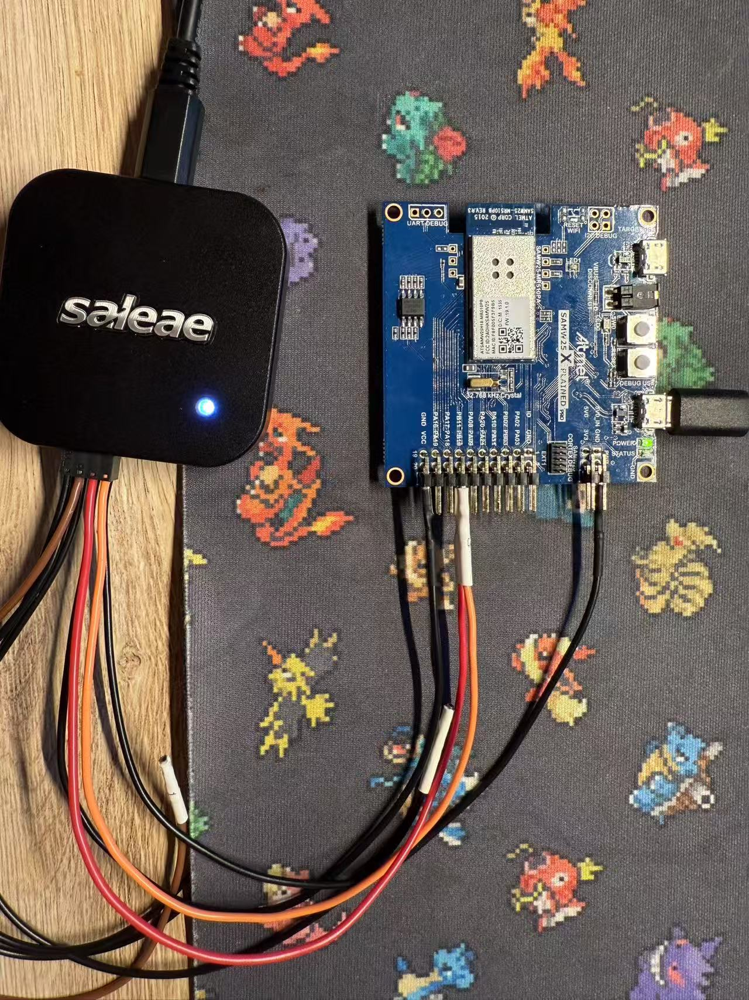

# a07g-exploring-the-CLI

* Team Number: 8
* Team Name: Gambler
* Team Members: Tianyu Gao, Hao Tan
* GitHub Repository URL: https://github.com/ese5160/final-project-a07g-a14g-t08-gambler.git
* Description of test hardware: (development boards, sensors, actuators, laptop + OS, etc)

# 1. Software Architecture  

## Hardware and Software Requirements Specification

### Hardware Requirements Specification

- **HRS 01 - Microcontroller Core:** The project shall use the SAMW25 microcontroller, which provides Wi-Fi connectivity.
- **HRS 02 - Card Dealing:** A DC motor shall be used to control the number of cards dealt in a single turn. The quantity shall be managed by adjusting the motor's speed and operating duration.
- **HRS 03 - Direction Control:** A stepper motor shall be used at the base to control the card dealing direction. The motor shall support 2 to 4 directions, allowing the system to accommodate games with 2 to 4 players seamlessly.
- **HRS 04 - Card Count and Motor Optimization:**   
  - Shall use a Reflective Photo Interrupt Sensor to calculate the number of cards dealt by measuring the time it is obstructed during operation.
  - This sensor shall also aid in the control and optimization of the DC motor to ensure precise card dealing, as achieving accuracy with a DC motor alone can be challenging.
- **HRS 05 - Card Box Monitoring:** A Light Sensor shall be placed in the card box to monitor the remaining cards, ensuring the system can provide real-time updates on card availability.
- **HRS 06 - I2C Screen:** An I2C screen displays game mode details, the number of players, and the selected randomization method.
- **HRS 07 - Wi-Fi Internet Connectivity:** Shall utilize the integrated Wi-Fi in the SAM W25, the device shall connect to the internet, enabling it to upload acquired data to a remote display and allowing for remote control.

### Software Requirements Specification

- **SRS 01 – Initialization and Configuration:**
  - The system shall initialize and configure the SAMW25 microcontroller, including setting up the Wi-Fi module and any necessary network configurations.
- **SRS 02 – Randomization and Shuffle Logic:**
  - The software shall implement a PRNG to randomize the sequence of card dealing, ensuring fairness.
  - Users may select or adjust the randomization method via the mobile app if multiple shuffle intensities are available.
- **SRS 03 – DC Motor Control for Card Output:**
  - The software shall determine the DC motor speed and duration based on the required number of cards per dealing cycle.
  - It shall adjust motor operation in real-time, using sensor feedback to correct miscounts or jams.
- **SRS 04 – Stepper Motor Direction Control:**
  - The software shall rotate the stepper motor to direct the next card(s) to the selected player position (2–4 possible directions).
  - The system must handle transitions smoothly, preventing mechanical stress or misaligned deals.  
- **SRS 05 – Sensor Integration for Card Counting:**
  - The software shall continuously read the Reflective Photo Interrupt Sensor to count cards as they are dealt, ensuring accuracy.
  - A light sensor, placed within the card tray, shall monitor the deck supply, triggering empty-deck alerts.
- **SRS 06 – Wi-Fi Connectivity and Remote Control:**
  - The software shall connect to a local network using the SAMW25’s Wi-Fi interface.
  - The user shall be able to configure game parameters (e.g., player count, game mode, dealer position) through a mobile or web-based interface.

There are mainly 4 parts in the card dealing machine:
- A **DC motor** shall be used to control the number of cards dealt in a single turn in one direction
- A **stepper motor** shall be used at the base to control the card dealing direction. (2 to 4 directions)
- A **Reflective Photo Interrupt Sensor**

# 4.Wiretap the convo

- **1. What nets must you attach the logic analyzer to? (Check how the firmware sets up the UART in SerialConsole.c!)**
The pin configurations are defined by EDBG_CDC_SERCOM_PINMUX_PAD0 through EDBG_CDC_SERCOM_PINMUX_PAD3. These pins are used for the UART communication between the microcontroller and the computer.

- **2. Where on the circuit board can you attach / solder to?**
#define EDBG_CDC_SERCOM_PINMUX_PAD0  PINMUX_UNUSED
#define EDBG_CDC_SERCOM_PINMUX_PAD1  PINMUX_UNUSED
#define EDBG_CDC_SERCOM_PINMUX_PAD2  PINMUX_PB10D_SERCOM4_PAD2
#define EDBG_CDC_SERCOM_PINMUX_PAD3  PINMUX_PB11D_SERCOM4_PAD3
so I will attach to PB10 or PB11

- **3. What are critical settings for the logic analyzer?**
Set the analyzer to UART protocol with:
Baud rate: 115200 (matching the firmware)
Data bits: 8
Parity: None
Stop bits: 1

- **Hardware connection**

